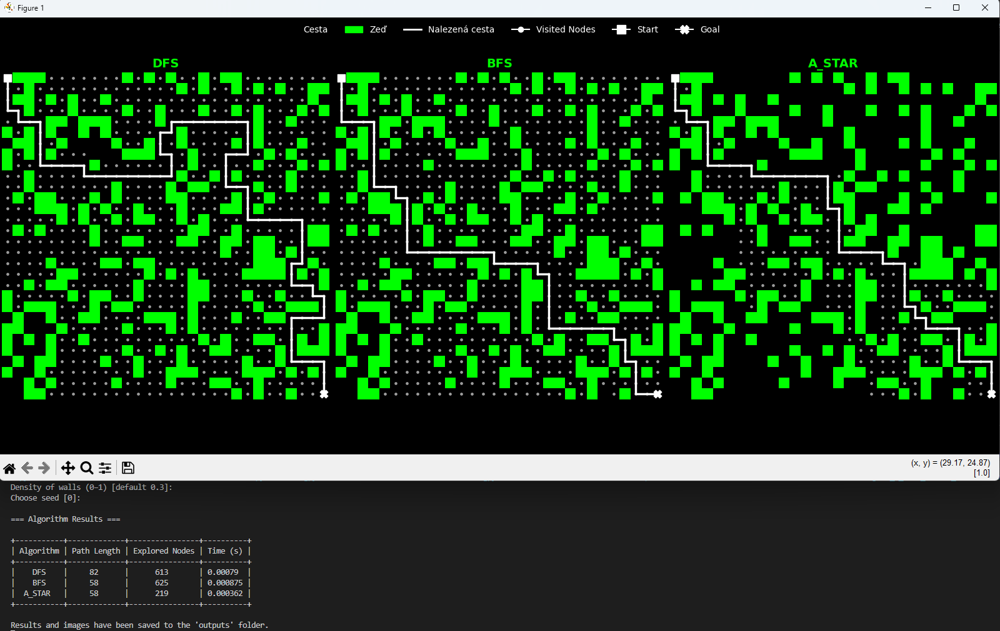

# Projekt: Řešení bludiště (DFS, BFS, A*)

Tento projekt demonstruje a porovnává chování algoritmů **DFS**, **BFS** a **A\*** na procedurálně generovaných bludištích.  
Bludiště jsou vytvářena buď náhodně pomocí PRNG generátoru, nebo strukturovaně pomocí **Primova algoritmu**.

---

<p align="center">
  
</p>

---

## Funkce projektu

- **Generování bludišť:**
  - Náhodný generátor (PRNG) s nastavitelnou hustotou (`density`) a seedem (`seed`)
  - Strukturovaný generátor podle **Primova algoritmu**
- **Implementované algoritmy:**
  - *DFS (Depth-First Search)* – prohledávání do hloubky  
  - *BFS (Breadth-First Search)* – prohledávání do šířky  
  - *A* Search* – s podporou více heuristik:
    - Manhattanova vzdálenost  
    - Euklidovská vzdálenost  
    - Diagonální vzdálenost  
- **Vizualizace:**
  - Styl „hacker terminálu“ – černé pozadí, zelené zdi, bílé cesty  
  - Společná legenda pro všechny grafy  
  - Výsledky všech algoritmů vykreslené vedle sebe v jednom okně  
- **Benchmark mód** – automatické vyhodnocení výkonu algoritmů na několika různých bludištích  
- **Export výsledků:**
  - Tabulka v konzoli  
  - Obrázky (`.png`) ve složce `outputs/`  
  - Soubor s výsledky (`vysledky.csv`, `benchmark.csv`)

---

## Použití

Spusť program z příkazové řádky:

```bash
python main.py
Po spuštění program vyzve k zadání parametrů:
```

Zadejte hustotu bludiště (0–1, např. 0.3): 0.25
Zadejte seed (např. 42): 123
Ukázka výstupu v konzoli
```
=== Výsledky algoritmů ===

+------------+--------------+-----------------+---------+
| Algoritmus | Délka cesty  | Prozkoumané uzly | Čas (s) |
+------------+--------------+-----------------+---------+
| DFS        |     58       |       312       | 0.0003  |
| BFS        |     42       |       198       | 0.0004  |
| A* Search  |     42       |       156       | 0.0002  |
+------------+--------------+-----------------+---------+

Tabulka byla uložena do: outputs/vysledky.csv
Benchmark algoritmů
Měření výkonu na více náhodných bludištích:
```


benchmark_algorithms()
Výsledky se uloží do outputs/benchmark.csv a zároveň se zobrazí průměrné hodnoty pro každý algoritmus.


## Knihovny:
```
numpy, matplotlib, pandas, tabulate
```

## Instalace závislostí:

pip install -r requirements.txt
Struktura projektu
```
.
├── maze/
│   ├── __init__.py
│   ├── algorithms.py
│   ├── generator.py
│   ├── visualize.py
├── outputs/
│   ├── DFS.png
│   ├── BFS.png
│   ├── Astar_manhattan.png
│   ├── vysledky.csv
│   ├── benchmark.csv
├── main.py
├── requirements.txt
├── README.md
└── gui.png
```
##Teoretické pozadí
DFS (Depth-First Search) – prohledává cesty do hloubky; rychlý, ale nemusí najít nejkratší cestu.

BFS (Breadth-First Search) – prohledává do šířky; garantuje nejkratší cestu, ale zpracovává více uzlů.

A* – využívá heuristiku pro odhad vzdálenosti k cíli, čímž zrychluje hledání optimální cesty.
Při vhodně zvolené heuristice (např. Manhattan) je A* optimální a výrazně efektivnější než BFS.
